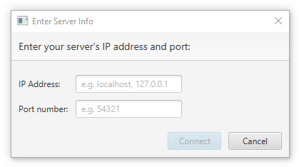
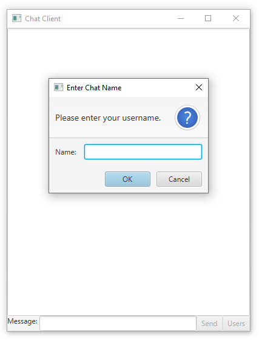
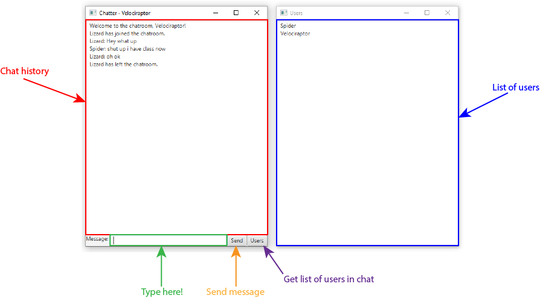

# BasicChatApp
BasicChatApp is a minimalist chat application that you can use with your friends, family, and/or enemies. We scorn decadence and avoid the use of such applications like Discord and Slack. We believe in simplicity, and our mission is to cater to your every simple need.

You can use our product in two ways, through a command line or through an interface. Click on the links below to jump to the proper section quickly.

[Command Line Guide](#command-line-guide)\
[Interface Guide](#interface-guide)

# Command Line Guide
## Getting Started
First, clone the repository. To start chatting, one machine must be running `ChatServer.java` first. If you successfully compile and run `ChatServer.java`, you should get the following output:
```
Chat Server started.
Local IP: [YOUR IP]
Local Port: 54321 
```

Then, anyone who would like to chat must successfully compile and run `ChatClient.java` (Note: You cannot chat as a user through `ChatServer.java`). Upon running `ChatClient.java`, it should prompt you for an IP:
```
What's the server IP?
```

Type in the IP from `ChatServer.java` and hit enter. Then, you will be prompted for a port number:
```
What's the server IP?
[YOUR IP]
What's the server port?
```

Type in the port from `ChatServer.java` and hit enter.

Now, you should be prompted for a username. This is the name that will represent you in the chat room. The name must be unique, so if a name is already taken, it will prompt you again.
```
What's the server IP?
[YOUR IP]
What's the server port?
54321
Enter your username:
```
Now, you should see a list of users currently in the chat room. You have now joined the chat room and should be able to send and receive messages!

## Chatting Basics
Once you have joined a chat room, you can send a message anytime. You can do this by typing and hitting enter when you are done. Your message will appear in the form of `[NAME]: [MESSAGE]` to other people. Here's an example conversation below:
```
Lizard: Hey what up
Spider: shut up i have class now
Lizard: oh ok
```

Whenever anyone joins the chat room, a message will be brodcasted to everyone saying that `[NAME] has joined.` If you want to leave the chat room, type in `/quit`, which will also brodcast to everyone in the room `[NAME] has left.` For example:
```
Lizard has joined.
Lizard: Hey what up
Spider: shut up i have class now
Lizard: oh ok
Lizard has left.
```

## Advanced chatting features
### Private Messaging
If you want to message a specific person but no one else in the chat room, you can use a private message to do so. Simply prefix your message with `@[THEIR USERNAME]` and whoever's username you put next to the `@` will be the only person to receive the message. For example, if you were Lizard and typed `@Velociraptor all my homies hate spider`, then whoever is named "Velociraptor" (and only Velociraptor) will get the following:
```
Lizard (private): all my homies hate spider
```
You can also private message more than one person at a time (including yourself if you have no friends). Simply add more `@[THEIR USERNAME]` at the beginning in the following manner: `@[USER 1] @[USER 2] @[USER 3] [YOUR MESSAGE]`.

### List of Users
`/whosishere` is a command that will list all of the users currently in the chat room. Anyone who is not connected yet or has already left will not appear on the list. It is especially useful when you want to private message someone but are not sure who your choices are or what their username is. It can also be used to reassure yourself that you have friends to talk to. It can also have the opposite effect.
```
/users
Users: Lizard, Spider, Velociraptor
```

*Note: In the previous release of this product, this command was the special command `/users`. This command was renamed to `/whoishere` in the latest release.*

# Interface Guide
## Getting Started
First, clone the repository. To start chatting, one machine must be running `ChatServer.java` first. If you successfully compile and run `ChatServer.java`, you should get the following output:
```
Chat Server started.
Local IP: [YOUR IP]
Local Port: 54321 
```

Then, anyone who would like to chat must successfully compile and run `ChatGuiClient.java` (Note: You cannot chat as a user through `ChatServer.java`). If you have Java 8, then you may compile with no extra work. If you have a later version, you're ~~screwed~~ in for a treat :). The easiest way to do so is to install JavaFX from the [official site](https://openjfx.io/openjfx-docs/). Then, set an environment variable called `PATH_TO_FX` to the **lib** folder. Then, in a command line, navigate to the `src` directory and compile the program with the following commands:

Mac/Linux:\
`javac --module-path $PATH_TO_FX --add-modules javafx.controls ChatGuiClient.java`

Windows CMD:\
`javac --module-path %PATH_TO_FX% --add-modules javafx.controls ChatGuiClient.java`

Windows Powershell:\
`javac --module-path $env:PATH_TO_FX --add-modules javafx.controls ChatGuiClient.java`
 
Then, run the program with the following commands:

Mac/Linux:\
`java --module-path $PATH_TO_FX --add-modules javafx.controls ChatGuiClient`

Windows CMD:\
`java --module-path %PATH_TO_FX% --add-modules javafx.controls ChatGuiClient`

Windows Powershell:\
`java --module-path $env:PATH_TO_FX --add-modules javafx.controls ChatGuiClient`

Upon running `ChatGuiClient.java`, it should prompt you for an IP and PORT.
Type in the IP and PORT from `ChatServer.java` and click the "Connect" button. Alternatively, if you question your life decisions, you may select "Cancel" to exit the program.

<p align="center">
  
</p>

(Isn't that shadow cool?)

Now, you should be prompted for a username. This is the name that will represent you in the chat room. The name must be unique, so if a name is already taken, it will prompt you again. Type in your name and click the "OK" button to proceed to the chat room. Alternatively, if you have a sudden identity crisis, you may select "Cancel" to accomplish nothing. This is not on the grading rubric; just put in anything and leave right after.

<p align="center">
  
</p>

Now, you should see a list of users currently in the chat room. You have now joined the chat room and should be able to send and receive messages!

## Chatting Basics
Once you have joined a chat room, you can send a message anytime. You can do this by typing in the "Message" box at the bottom and hitting enter or send. When you are done. Your message will appear in the form of `[NAME]: [MESSAGE]` to other people. Here's an example conversation below:
```
Lizard: Hey what up
Spider: shut up i have class now
Lizard: oh ok
```

Whenever anyone joins the chat room, a message will be brodcasted to everyone saying that `[NAME] has joined.` If you want to leave the chat room, type in `/quit`, which will also brodcast to everyone in the room `[NAME] has left.` For example:
```
Lizard has joined the chatroom.
Lizard: Hey what up
Spider: shut up i have class now
Lizard: oh ok
Lizard has left the chatroom.
```

You may see a list of users currently in the chat room in the panel to the right.

<p align="center">
  
</p>

## Advanced chatting features
### Private Messaging
If you want to message a specific person but no one else in the chat room, you can use a private message to do so. Simply prefix your message with `@[THEIR USERNAME]` and whoever's username you put next to the `@` will be the only person to receive the message. For example, if you were Lizard and typed `@Velociraptor all my homies hate spider`, then whoever is named "Velociraptor" (and only Velociraptor) will get the following:
```
Lizard (private): all my homies hate spider
```
You can also private message more than one person at a time (including yourself if you have no friends). Simply add more `@[THEIR USERNAME]` at the beginning in the following manner: `@[USER 1] @[USER 2] @[USER 3] [YOUR MESSAGE]`.

### List of Users
Although you may always see the list of users to the right, you can also get it in chat by clicking the "Users" button. This is helpful in case you're too lazy to handle 2 panels. You may close the panel to the right and instead use the "Users" button to see the list of users if you wish to. Anyone who is not connected yet or has already left will not appear on the list. It is especially useful when you want to private message someone but are not sure who your choices are or what their username is. It can also be used to reassure yourself that you have friends to talk to. It can also have the opposite effect.
```
Users: Lizard, Spider, Velociraptor
```

*Note: In the previous release of this product, this feature was the special feature `/users` and thus is the special button for the latest release.*
